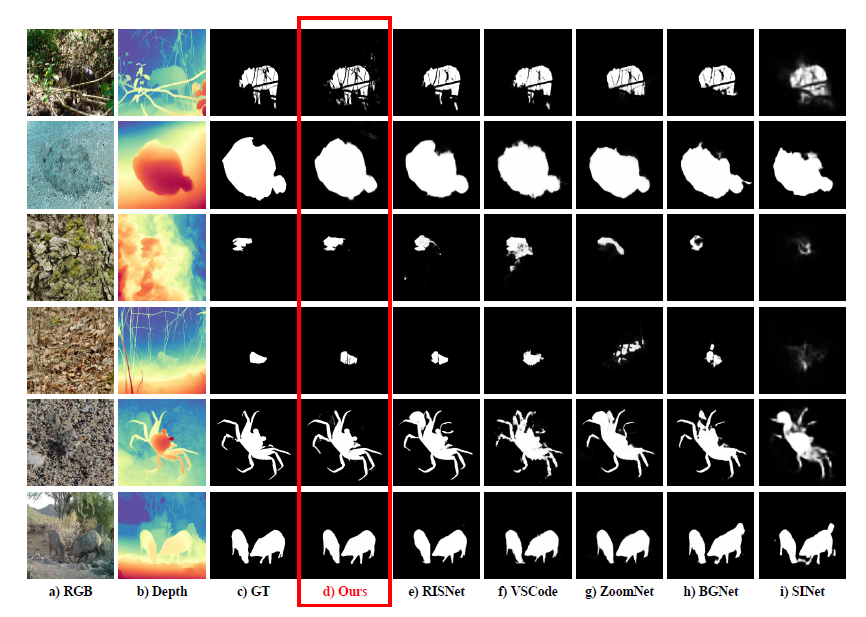

# SLSMamba: Shell-Like-Scan Cross-SSM VMamba with Depth and Edge enhancement for Camouflaged object detection

 
- ## This repo contains an official PyTorch implementation of our paper:  
- SLSMamba: Shell-Like-Scan Cross-SSM VMamba with Depth and Edge enhancement for Camouflaged object detection

# Visualize the results

#### We qualitatively compared our model with other methods. In order to clearly highlight the superiority of our model, illustrats the results of several methods. It can be seen that our model can accurately identify camouflaged objects in various environments, such as occluded objects (in row 1), large objects (in row 2, 5), small objects (in row 3, 4), foreground and background are highly similar (in row 2, 3, 4, 5), objects with many details (in row 5), and multiple camouflaged objects (in row 6), while other methods fail to detect camouflaged objects. Overall, our model can accurately locate the position of camouflaged objects.

